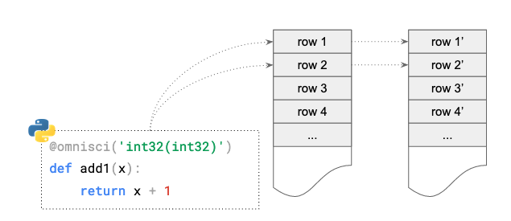

# User Defined Functions \(UDF\)

## Runtime UDF Support

The _Remote Backend Compiler_ \(RBC\) package implements the OmniSciDB client support for defining so-called Runtime UDFs. That is, while OmniSciDB server is running, one can register new SQL functions to Omnisci Calcite server as well as provide their implementations in LLVM IR string form. The RBC package supports creating Runtime UDFs from Python functions.

A User-Defined Function brings the capability of defining new SQL functionalities that work in a rowwise fashion manner. The figure below illustrates how a UDF works:



### Example

First, we need to connect RBC to Omnisci server using the `RemoteOmnisci` remote class.

```python
from rbc.omniscidb import RemoteOmnisci
omnisci = RemoteOmnisci(user='admin', password='HyperInteractive',
                        host='127.0.0.1', port=6274, dbname='omnisci')
```

One can define UDF functions using `omnisci` as a decorator:

```python
@omnisci('int32(int32)')
def incr(i):
    return i + 1
```


